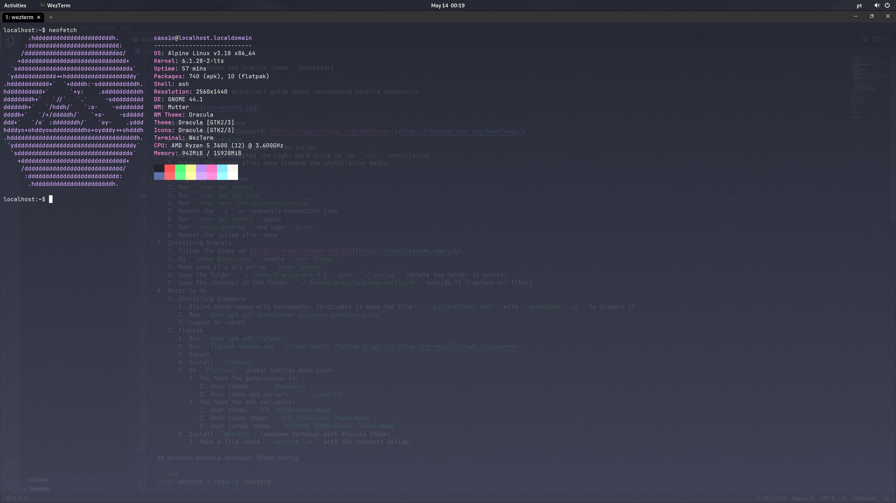

<h1 align="center">
  Alpine with Gnome and Dracula theme - Quickstart
</h1>

<h4 align="center">A quickstart guide about customizing vanilla Gnome</h4>

---



## Quickstart

1. Installing Base Alpine
   1. Download Alpine Standard: [https://alpinelinux.org/downloads/](https://alpinelinux.org/downloads/)
   2. Run ``setup-alpine``
   3. Follow the steps provided by the script
   4. Make sure you selected the right hard drive to run ``sys`` installation
   5. Reboot the system after done (remove the installation media)
2. Installing Gnome
   1. Login with your user
   2. Run ``doas apk update``
   3. Run ``doas apk add nano``
   4. Run ``doas nano /etc/apk/repositories``
   5. Remove the ``#`` on community repository line
   6. Run ``doas apk update`` again
   7. Run ``setup-desktop`` and type ``gnome``
   8. Reboot the system after done
3. Installing Dracula
   1. Follow the steps on [https://draculatheme.com/gtk](https://draculatheme.com/gtk)
   2. On ``Gnome Extensions`` enable ``User Themes``
   3. Make sure it's all set on ``Gnome Tweaks``
   4. Copy the folder ``~/.thems/Dracula/gtk-4.0`` into ``~/.config`` (delete the folder if exists)
   5. Copy the contenst in the folder ``~/.themes/Dracula/gnome-shell/v40`` outside it (replace all files)
4. Nices to do
   1. Installing pipewire
      1. Alpine Gnome comes with pulseaudio, to disable it make the file ``~/.pulse/client.conf`` with ``autospawn = no`` to disable it
      2. Run ``doas apk add wireplumber pipewire pipewire-pulse``
      3. Logout or reboot
   2. Flatpak
      1. Run ``doas apk add flatpak``
      2. Run ``flatpak remote-add --if-not-exists flathub https://flathub.org/repo/flathub.flatpakrepo``
      3. Reboot
      4. Install ``Flatseal``
      5. On ``Flatseal`` global configs make sure:
         1. You have the permissions to:
            1. User themes: ``~/.themes:ro``
            2. User icons and cursors: ``~/.icons:ro``
         2. You have the env variables:
            1. User theme: ``GTK_THEME=Theme-Name``
            2. User icons theme: ``GTK_ICONS=Icon-Theme-Name``
            3. User cursor theme: ``XCURSOR_THEME=Cursor-Theme-Name``
      6. Install ``Wezterm`` (awesome terminal with dracula theme)
         1. Make a file named ``.wezterm.lua`` with the contents bellow:

## Wezterm Dracula Gradient Theme Config

```lua
local wezterm = require 'wezterm'

local config = {}

if wezterm.config_builder then
  config = wezterm.config_builder()
end

config.color_scheme = 'Dracula (Official)'

config.window_background_opacity = 0.88

config.window_decorations = "INTEGRATED_BUTTONS|RESIZE"

config.window_background_gradient = {
  interpolation = 'Linear',

  orientation = 'Vertical',

  blend = 'Rgb',

  colors = {
    '#282a36',
    '#44475a',
  },
}

return config
```

## .Profile

```sh
export LANG=en_US.UTF-8
export LC_ALL=en_US.UTF-8
export LANGUAGE=en_US.UTF-8
```
